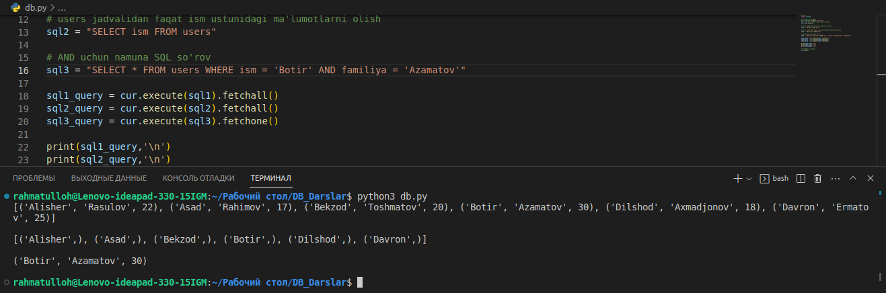
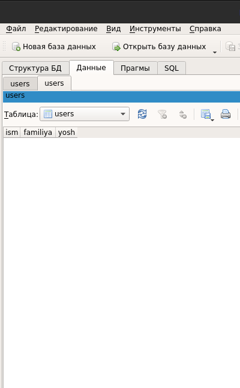

# **SQLite bilan ishlashni o'rganamiz**

### Assalomu alaykum. Ushbu maqolada biz siz Python dasturlash tili orqali SQLite ma'lumotlar bazasi bilan ishlashni o'rganamiz!
<br>

### Dastlab ma'lumotlar bazasi nimaga kerakligi va qaysi o'rinlarda ishlatilishini ko'rib chiqsak:
<br>
Tasavvur qilaylik bizning saytimiz bor va biz ushbu saytimizga "**Ro'yxatdan o'tish**" (Sign Up) va "**Tizimga kirish**" (Log in) qismini qo'shmoqchimiz. Foydalanuvchi "Ro'yxatdan o'tish" bo'limida kiritgan foydalanuvchi nomi va parolni saqlab qo'yishimiz kerak, aynan ushbu o'rinda bizga **ma'lumotlar bazasi**(DataBase) yordam beradi. "Tizimga kirish" qismida esa foydalanuvchi kiritgan foydalanuvchi nomi va parolni olib, uni ma'lumotlar bazasidagi ma'lumotlar bilan solishtiramiz, ushbu foydalanuvchi nomi ma'lumotlar bazasida bo'sa va parol to'g'ri kelsa o'tkazamiz, aks xolda yo'q. Sodda qilib aytganda har bir dasturda biror bir ma'lumotni saqlash uchun ma'lumotlar bazasidan foydalaniladi.

<br>

> Katta loyihalarda SQLitedan foydalanish tavsiya etilmaydi.

### Maqola davomida ishlatiladigan so'zlar:
- DataBase(DB) — ma'lumotlar bazasi;
- Table(Jadval) — ma'lumotlar saqlanadigan jadval;
- Column(Ustun) — jadvalning ichidagi ustun;
- CREATE(yaratish) — ma'lumotlar bazasida jadval yaratish uchun qo'llaniladigan SQL so'rov turi;
- INSERT(Kiritmoq) — ma'lumotlar bazasiga ma'lumotlarni kiritish uchun, yani saqlash uchun qo'llaniladigan SQL so'rov turi;
- SELECT — ma'lumotlar bazasidan ma'lumotlarni olish uchun qo'llaniladigan SQL so'rov turi;
- UPDATE(Yangilash) — ma'lumotlar bazasidagi ma'lumot(lar)ni yangilash uchun qo'llaniladigan SQL so'rov turi;
- DELETE(O'chirish) — ma'lumotlar bazasidagi ustun yoki undagi qiymatlarni o'chirish uchun qo'llaniladigan SQL so'rov turi.

Hozirda ushbu atamalar va so'zlar sizga chunarsiz bo'lib ko'rinishi mumkin, maqolamiz davomida haqiqiy praktikada chunib olasiz degan umiddamiz.

## **Kirish qismi**

Ushbu maqolada biz siz bilan SQL'dagi CREATE, INSERT, SELECT, UPDATE va DELETE so'rovlarni SQLiteda qo'llashni ko'ramiz.

Python dasturlash tilida SQLite ma'lumotlar bazasi bilan ishlash uchun `sqlite3` kutubxonasidan foydalanamiz. Ushbu kutubxona python dasturlash tili bilan birga o'rnatilgan bo'ladi, shu sabab o'rnatish shart emas.


## **Kod yozishga kirishamiz**

### Ma'lumotlar bazasiga ulanamiz

Yangi `.py` fayl ochib, unga quyidagilarni yozamiz:
```python
# db.py
import sqlite3


# Database'ga ulanamiz
con = sqlite3.connect('users.db')
# SQL so'rovlar uchun cursor yaratib olamiz
cur = con.cursor()

# SQLite versiyasini olamiz
cur.execute("SELECT sqlite_version();") 
sqlite_version = cur.fetchall()
print("SQLite versiyasi:", sqlite_version)

# Database'ni yopamiz
con.close()
```

Endi keling kodni chuqurroq ko'rib chiqamiz:

- `con = sqlite3.connect('users.db')` — sqlite3 kutubxonasidagi `connect()` funksiyasi orqali `users.db` ma'lumotlar bazasiga ulanamiz;
- `cur = con.cursor()` — `con` o'zgaruvchisidan, ya'ni `connect()` ob'yektidan `cursor()` funksiyasini olib, `cur` o'zgaruvchisiga olamiz;
- `cur.execute()` — `cur`ning `execute()` funksiyasi orqali biz SQLite so'rovlarni bajaramiz;
- `sqlite_version = cur.fetchall()` — `execute()` orqali yuborilgan SQLite so'rovdan qaytgan barcha natijalarni olamiz;
- `con.close()` — Database bilan ulanishni yopamiz.

> `fetchall()`'dan tashqari `fetchone()` funksiyasi ham mavjud. Ushbu funksiya orqali yuborilgan SQLite so'rovdan qaytgan faqatgina bitta natijani olamiz.


Kodni ishga tushurib, natijani ko'ramiz:
```console
SQLite versiyasi: [('3.31.1',)]
```

Agar kodingizni ishga tushirgan direktoriyaga qarasangiz, ko'rasizki u yerda yangi `users.db` nomli fayl yaratilgan bo'ladi. Ana shu fayl ma'lumotlar bazasi hisoblanadi va barcha ma'lumotlar shu faylning ichida saqlanadi. Ushbu faylni `connect()` funksiyasi avtomatik yaratgan. `connect()` funksiyasi kiritilgan nomdagi(bizda `users.db` nomda) fayl kodimiz ushga tushirilgan direktoriyada mavjud bo'lsa, ushbu faylga ulanadi,aks xolda yangi ushbu nomdagi fayl ochadi.

### Create

SQL'dagi CREATE so'rov turi orqali biz ma'lumotlar bazasida yangi jadval(Table) yaratamiz.

Jadval yaratishdan oldin unda qanday ma'lumotlar saqlanishini o'ylab, ushbu ma'lumotlar uchun alohida-alohida jadvalning ichida ustunlar yaratib olish kerak.

Ma'lumotlar bazasida nimalarni saqlashimizni ko'ramiz:
- ism — foydalanuvchi ismi;
- familiya — foydalanuvchi familiyasi;
- yosh — foydalanuvchining yoshi.

Endi keling users nomli jadval va uning ichida ism,familiya va yosh nomli ustunlar yaratamiz:

```python
# db.py
import sqlite3


# Database'ga ulanamiz
con = sqlite3.connect('users.db')
# SQL so'rovlar uchun cursor yaratib olamiz
cur = con.cursor()

# Ustun yaratish uchun SQL so'rov
create_users_table = """CREATE TABLE IF NOT EXISTS users(
    ism TEXT NOT NULL,
    familiya TEXT NOT NULL,
    yosh INTEGER
);"""

# Yangi ustun yaratib olamiz
cur.execute(create_users_table)
# O'zgarishlarni saqlaymiz
con.commit() 

# Database'ni yopamiz
con.close()
```

Kodimizda unchalik katta o'zgarish bo'lmadi, faqat `con.commit()` qo'shildi. `commit()` funksiyasining vazifasi o'zgartirilgan ma'lumotlarni saqlash. Yani biz ma'lumotlar bazasida o'zgartirish kiritganimizdan so'ng, `commit()` qilib ushbu o'zgarishlarni saqlashimiz kerak, aks xolda saqlanmaydi.

SQL so'rovga keladigan bo'lsak:
- `CREATE TABLE IF NOT EXISTS users();` — agar users nomli ustun bazada mavjud bo'lmasa, users nomli ustun yarat dedik;

  Ushbu jadvalning ustunlari:
- `ism TEXT NOT NULL` — ism: ustun nomi, TEXT: ustunning ma'lumot turi, NOT NULL: ushbu maydonni bosh qoldirishni cheklaydi,yani ismni kiritmasdan ustunda yangi qator yarata olmaysiz;
- `familiya TEXT NOT NULL` — familiya: ustun nomi,TEXT: ustunning ma'lumot turi, NOT NULL: ushbu maydonni bosh qoldirishni cheklaydi,yani ismni kiritmasdan ustunda yangi qator yarata olmaysiz;
- `yosh INTEGER` — yosh: ustun nomi,INTEGER: ustunning ma'lumot turi.

> Barcha SQLite'dagi ma'lumotlar turlari bilan tanishib chiqish uchun: [havola](https://www.sqlite.org/datatype3.html)

Endi kodni ishga tushiramiz. Kod xatoliklarsiz ishga tushgan bo'lsa users nomli ustun muvaffaqiyatli yaratilgan bo'ladi. Shu o'rinda bir savol tug'iladi:

### Qanday qilib ma'lumotlar bazasidagi ma'lumotlarni ko'rsak bo'ladi?

Buning uchun kompyuterimizga qo'shimcha DB Browser nomli dasturni o'rnatishimiz kerak bo'ladi. Yuklab olish uchun link:

[https://sqlitebrowser.org/dl/](https://sqlitebrowser.org/dl/)

Yuklab olganingizdan so'ng dasturni oching va **CTRL + O** tugmalar kambinatsiyasini bosib, ma'lumotlar bazasi turgan direktoriyaga kirib, ma'lumotlar turgan `.db` faylni(yani `users.db`) tanlaymiz va **Open** tugmasini bosamiz:


> Suratdagi oyna operatsion tizimga qarab biroz farq qilishi mumkin.

`users` nomli yangi jadval yaratilganiga ishonch xosil qilamiz:


### INSERT
SQL'dagi INSERT so'rov turi orqali biz ma'lumotlar bazasiga yangi ma'lumotlarni saqlaymiz.

Maqolaning yuqoriroq qismida biz jadval yaratib olgan edik, endi ushbu jadvalga ma'lumotlarni saqlashni ko'ramiz:

```python
# db.py
import sqlite3

# Database'ga ulanamiz
con = sqlite3.connect('users.db')
# SQL so'rovlar uchun cursor yaratib olamiz
cur = con.cursor()

# Ma'lumotlarni saqlash uchun SQL so'rov
insert_query = """INSERT INTO users (ism,familiya,yosh) VALUES(
    'Alisher', 'Rasulov', 22
);"""

# Ma'lumotlarni saqlaymiz
cur.execute(insert_query)
# O'zgarishlarni saqlaymiz
con.commit() 

# Database'ni yopamiz
con.close()
```

Kodimizni ishga tushirib ma'lumotlar bazasini ko'radigan bo'lsak:


Ko'rib turganingizdek ma'lumotlar `users` nomli jadvalga muvaffaqiyatli saqlandi.

Quyidagi bo'limlardagi misollar chunarliroq bo'lishi uchun `users` jadvaliga ko'proq ma'lumotlarni saqlab olamiz:

```python
# db.py
import sqlite3

# Database'ga ulanamiz
con = sqlite3.connect('users.db')
# SQL so'rovlar uchun cursor yaratib olamiz
cur = con.cursor()

# Ma'lumotlar
insert_values = [
    {
        'ism': 'Asad',
        'familiya': 'Rahimov',
        'yosh': 17,
    },
    {
        'ism': 'Bekzod',
        'familiya': 'Toshmatov',
        'yosh': 20,
    },
        {
        'ism': 'Botir',
        'familiya': 'Azamatov',
        'yosh': 30,
    },
    {
        'ism': 'Dilshod',
        'familiya': 'Axmadjonov',
        'yosh': 18,
    },
    {
        'ism': 'Davron',
        'familiya': 'Ermatov',
        'yosh': 25,
    }
]

# Ma'lumotlarni saqlaymiz
for value in insert_values:
    cur.execute("INSERT INTO users (ism,familiya,yosh) VALUES(?,?,?)",(value['ism'],value['familiya'],value['yosh'],))

# O'zgarishlarni saqlaymiz
con.commit() 

# Database'ni yopamiz
con.close()
```

Shunda `users` jadvalida quyidagi ma'lumotlar bo'ladi:


### SELECT

SQL'dagi SELECT so'rov turi orqali biz ma'lumotlar bazasida o'zimizga kerakli ma'lumot(lar)ni olamiz.

Keling endi kod qismiga o'tamiz:
```python
# db.py
import sqlite3

# Database'ga ulanamiz
con = sqlite3.connect('users.db')
# SQL so'rovlar uchun cursor yaratib olamiz
cur = con.cursor()

# users jadvalidan barcha ma'lumotlarni olish
sql1 = "SELECT * FROM users"

# users jadvalidan faqat ism ustunidagi ma'lumotlarni olish
sql2 = "SELECT ism FROM users"

# users jadvalidan ism ustunidagi qiymati Botir bo'lgan qatordagi barcha ma'lumotlarni olish
sql3 = "SELECT * FROM users WHERE ism = 'Botir'"

sql1_query = cur.execute(sql1).fetchall()
sql2_query = cur.execute(sql2).fetchall()
sql3_query = cur.execute(sql3).fetchone()

print(sql1_query,'\n')
print(sql2_query,'\n')
print(sql3_query,'\n')

# Database'ni yopamiz
con.close()
```

Natija:


Shu bilan birga SELECT so'rov turida AND parametri ham mavjud bo'lib, ushbu parametr orqali faqatgina bitta shart emas, balki ikkita yoki undan ham ko'proq shartlar berishimiz mumkin. Masalan biz `sql3` o'zgaruvchisida turgan SQL so'rovda `users` jadvalidagi ism ustuni Botir'ga teng bo'lgan qatorni olishinini aytdik. Biz ism ustuni Botir'ga, familiya ustuni esa Toshmatov'ga teng bo'lgan qatorni olish uchun esa `AND` parametrini qo'shamiz, shunda SQL so'rov turi shunday ko'rinishda bo'ladi:

`SELECT * FROM users WHERE ism = 'Botir' AND familiya = 'Toshmatov';`

Natijaga keladigan bo'lsak:


> `AND` parametridan nafaqat SELECT SQL so'rov turida, balki boshqa SQL so'rov turlarida ham foydalansa bo'ladi.

AND'dan foydalangan SQL so'rovimizning natijasi `None` bo'ldi, yani `users` jadvalida ushbu parametrlarga qator topilmadi. Buning sababi esa rosdan ham ism ustuni Botir'ga, familiya ustuni esa Toshmatov'ga teng bo'lgan qator mavjud emas. Agar SQL so'rovimizdagi `familiya = 'Toshmatov'` qismini `familiya = 'Azamatov'`ga o'zgartirsak ushbu parametrlardagi qator mavjud bo'lganligi sababli bizga ushbu qatordagi qiymatlarni qaytaradi:



O'ylaymizki sizga SELECT SQL so'rov turi chunarli bo'ldi.

### UPDATE
SQL'dagi UPDATE so'rov turi orqali biz ma'lumotlar bazasida ma'lumot(lar)ni qiymatini yangilaymiz.

Tassavur qiling, biz ism ustuni **Alisher**ga teng bo'lgan qatordagi `yosh` ustunidagi qiymatni 25'ga o'zgartirishimiz kerak. Ushbu vaziyatda bizga aynan UPDATE SQL so'rov turi yordam beradi. Keling kod qismiga o'tsak:
```python
# db.py
import sqlite3

# Database'ga ulanamiz
con = sqlite3.connect('users.db')
# SQL so'rovlar uchun cursor yaratib olamiz
cur = con.cursor()

# users jadvalidagi ism ustuni Alisherga teng qatordagi yoshni o'zgartiramiz 
update_query = "UPDATE users SET yosh = 25 WHERE ism = 'Alisher'"

# users jadvalidan ism ustuni Alisherga teng bo'lgan qatordan yosh ustunidagi qiymatni olish
select_sql = "SELECT yosh FROM users WHERE ism = 'Alisher'"

yosh = cur.execute(select_sql).fetchone()

print("Alisherning hozirgi yoshi: ",yosh[0])

# UPDATE
cur.execute(update_query)

# Database'dagi o'zgarishlarni saqlaymiz
con.commit()

yangi_yoshi = cur.execute(select_sql).fetchone()

print(f"Alisherning yoshi {yangi_yoshi[0]}ga o'zgartirildi!")

# Database'ni yopamiz
con.close()
```

Natija esa:
```console
Alisherning hozirgi yoshi:  22
Alisherning yoshi 25ga o'zgartirildi!
```

Biror qiymatni o'zgartirishni ko'rdik, lekin shu o'rinda savol tug'ilishi mumkin:

### Eski qiymatga qanday qilib biror qiymatni qo'shsa bo'ladi?

Hozirda ism ustunida Alisher'ga teng bo'lgan qatorda yosh nomli ustunda 25 turibdi. Sodda qilib aytadigan bo'lsak Alisher'ning yoshi 25da turibdi. Ushbu 25ga biz 3 qo'shmoqchimiz, yani yoshini 28 qilib qo'ymoqchimiz. Buning uchun eski qiymatiga `+ 3` qilamiz:

`UPDATE users SET yosh = yosh + 3 WHERE ism = 'Alisher'`

Keling kodni ishga tushirib natijasini ko'ramiz:


Ko'rib turganingizdek yosh ustunidagi qiymatga `yosh + 3` orqali eski yoshiga, yani 25ga 3'ni qo'shdik. Ayirish uchun esa `+` o'rniga `-` qo'ysangiz kifoya.

### DELETE

SQL'dagi DELETE so'rov turi orqali biz ma'lumotlar bazasida ma'lumot(lar)ni o'chiramiz.

Masalan bizga ism ustunidagi qiymati Davron bo'lgan qatorni o'chirmoqchimiz. Buning uchun biz DELETE SQL so'rov turidan va WHERE parametridan foydalanamiz:
```python
# db.py
import sqlite3

# Database'ga ulanamiz
con = sqlite3.connect('users.db')
# SQL so'rovlar uchun cursor yaratib olamiz
cur = con.cursor()

# users jadvalidagi ism ustuni Davron'ga teng qatorni o'chiramiz 
update_query = "DELETE FROM users WHERE ism = 'Davron'"

# DELETE
cur.execute(update_query)

# Database'dagi o'zgarishlarni saqlaymiz
con.commit()

# Database'ni yopamiz
con.close()
```

Kodni ishga tushirib, `users` jadvalini ko'radigan bo'lsak ism ustuni Davron'ga teng bo'lgan qator o'chib ketti. Sodda qilib etganda Davron'ni o'chirdik:


Ko'rib turganingizdek Davron muvaffaqiyatli "chopildi":).

Jadvaldagi barcha qatorlar esa quyidagi o'chiriladi:

```python
# db.py
import sqlite3

# Database'ga ulanamiz
con = sqlite3.connect('users.db')
# SQL so'rovlar uchun cursor yaratib olamiz
cur = con.cursor()

# users jadvalidagi barcha ustunlarni o'chiramiz
update_query = "DELETE FROM users"

# DELETE
cur.execute(update_query)

# Database'dagi o'zgarishlarni saqlaymiz
con.commit()

# Database'ni yopamiz
con.close()
```

Yuqoridagi kodni ishga tushirib, DB Browser orqali `users` ustunini ko'rsak barcha ustunlar o'chirilganini guvohi bo'lishimiz mumkin:



## **Maqola oxiri**

Ushbu maqolamiz davomida biz siz bilan SQLite ma'lumotlar bazasi bilan python dasturlash tilida, sqlite3 kutubxonasi orqali ishlashni ko'rib chiqdik. SQL'da boshqa ko'plab so'rov turlari va qo'shimcha parametrlar mavjud. Biz siz bilan faqatgina asosiylarini ko'rib chiqdik. Umid qilamizki ushbu maqolamizdan ozroq bo'lsada foyda oldingiz. 

Maqola bo'yicha savol yoki takliflar tug'ilsa "Comment" qismiga yozib qoldirishingiz mumkin.

## **E’tiboringiz uchun rahmat!**
